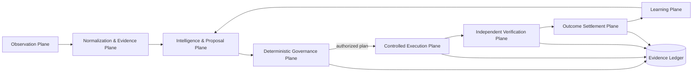

# 1. Complete Module Architecture

## 1.1 System objective

The Paid Growth and Conversion Operating System maximizes **verified, lawful, incremental business value** under customer-defined authority, budget, truth, privacy, policy, reversibility and evidence constraints. It does not optimize clicks, leads or platform ROAS as terminal objectives.

## 1.2 Five-plane architecture

The diagram has eight logical stages but exactly three external connector families. Internal modules do not create additional connector families.

## 1.3 Modules

### A. Source and tenant boundary

- `SourceIdentityGate`: verifies protected-source bytes before product modification.
- `TenantBoundary`: binds every object to customer, advertiser, account and jurisdiction.
- `CredentialBroker`: issues short-lived, least-privilege credentials per connector capability.
- `CapabilityRegistry`: denies unregistered actions and silent authority expansion.

### B. Evidence and measurement

- `DemandCollector`: keyword, query, geography, device, schedule, auction and competition evidence.
- `WebMeasurementCollector`: page, form, call, booking and consent observations.
- `BusinessOutcomeCollector`: CRM, POS, invoice, payment, refund and fulfillment observations.
- `EvidenceNormalizer`: canonical units, currencies, time zones, identities and source lineage.
- `FreshnessEngine`: expires stale prices, inventory, policy snapshots and business claims.
- `IdentityResolver`: privacy-preserving deduplication with deterministic and probabilistic confidence labels.
- `FraudAndQualityFilter`: spam, bots, duplicate leads, synthetic traffic and impossible event chains.

### C. Intelligence and proposal

- `PaidDemandIntelligence`: service × location × urgency × customer-need matrix.
- `IntentClassifier`: commercial, informational, employment, competitor, support, educational, irrelevant or unknown.
- `TopologyLaboratory`: SKAG, themed group, match type, bidding, schedule, network, device and geo hypotheses.
- `IntentContinuityCompiler`: query → promise → page → form → follow-up → fulfillment → settlement contract.
- `CreativeFactory`: draft text, image, video, asset, extension and offer variants.
- `LandingPageExperimentEngine`: versioned, testable, rollback-ready pages.
- `WasteDetector`: negative-query candidates, leakage, disapprovals and spend anomalies.
- `OptimizationProposer`: emits bounded proposals, never direct mutations.

### D. Deterministic governance

- `PolicySnapshotRegistry`: exact retrieved policy text/hash, effective time, geography and platform.
- `EligibilityEngine`: advertiser, product, channel, jurisdiction, audience, age, consent, creative, page and data-use decision.
- `TruthClaimGate`: verifies every price, availability, testimonial, service and performance claim.
- `AuthorityEngine`: exact account, action, diff, budget, duration, geography and quorum binding.
- `RiskClassifier`: LOW, MODERATE, HIGH or PROHIBITED.
- `BudgetGovernor`: daily, campaign, tenant, experiment and lifetime caps.
- `PrivacyGate`: purpose, consent, minimization, retention, deletion and export controls.
- `ExperimentGate`: preregistration, power, sample-ratio, peeking and guardrail checks.
- `ReleaseCourt`: composes all gates; any missing required evidence is a deterministic denial.

### E. Controlled execution

- `PlanCompiler`: converts an approved proposal into immutable operations and compensating operations.
- `ExecutionLeaseService`: short-lived one-plan lease, nonce, idempotency key and replay defense.
- `ChannelExecutor`: adapter with exact operations; no free-form model tool use.
- `LandingPageDeployer`: content-addressed deploy, health check, screenshot and rollback pointer.
- `ConversionUploader`: uploads eligible offline outcomes with deduplication and adjustment support.
- `KillSwitch`: immediate tenant, connector, campaign, operation-class and global revocation.

### F. Verification and settlement

- `IndependentVerifier`: reads live state through a different credential or observation path than the writer.
- `DiffVerifier`: compares approved before/after hashes to observed live state.
- `SpendVerifier`: reconciles platform cost with account and invoice records.
- `OutcomeLedger`: records leads, customers, transactions, refunds, gross profit and contribution margin.
- `AttributionEngine`: OBSERVED, MATCHED, ATTRIBUTED or CAUSAL truth labels.
- `IncrementalityEngine`: randomized or credible quasi-experimental lift estimation.
- `SettlementEngine`: finalizes mutable outcomes after refund/cancellation windows.

### G. Learning without authority creep

- `ExperimentRegistry`: immutable hypotheses, metrics, populations and stop rules.
- `EvidenceMemory`: learned mechanisms with source, date, tenant scope and confidence.
- `PolicyLearningBoundary`: models may learn predictions; permissions cannot be learned or widened.
- `CapabilityPromotionCourt`: new capability requires tests, threat review, approval and versioned registration.

## 1.4 Non-negotiable separations

1. Proposal generation and authorization are separate processes.
2. Execution credentials cannot read private settlement data unless required by one exact operation.
3. Measurement credentials cannot mutate campaigns.
4. Settlement systems cannot publish ads.
5. The model cannot mint approvals, alter budgets, change policy snapshots or edit receipts.
6. Writer verification must use an independent read path.
7. Customer data is tenant-isolated in storage, cache, traces, prompts and exports.
8. Missing evidence means deny, quarantine or `NOT ESTABLISHED`; never infer permission.

## 1.5 Minimum deployable services

- `control-api`: proposals, approvals, plans, revocations and status.
- `policy-service`: deterministic snapshots and decisions.
- `evidence-service`: append-only evidence and receipt ledger.
- `orchestrator`: durable state machine with resumable approvals.
- `executor-worker`: one connector capability per worker identity.
- `verifier-worker`: read-only independent verification.
- `settlement-worker`: business outcomes and refunds.
- `experiment-service`: assignment, analysis and decision records.
- `operator-console`: review, diff, evidence, risk, rollback and kill switch.

## 1.6 Storage classes

- Immutable object store for artifacts, screenshots, exports and policy snapshots.
- Append-only ledger for receipts and hash-chain checkpoints.
- Relational store for typed operational state.
- Analytical store for normalized events and experiments.
- Secret manager for credentials; secrets never enter prompts or receipts.
- Privacy vault for direct identifiers; analytical records use pseudonymous IDs.
