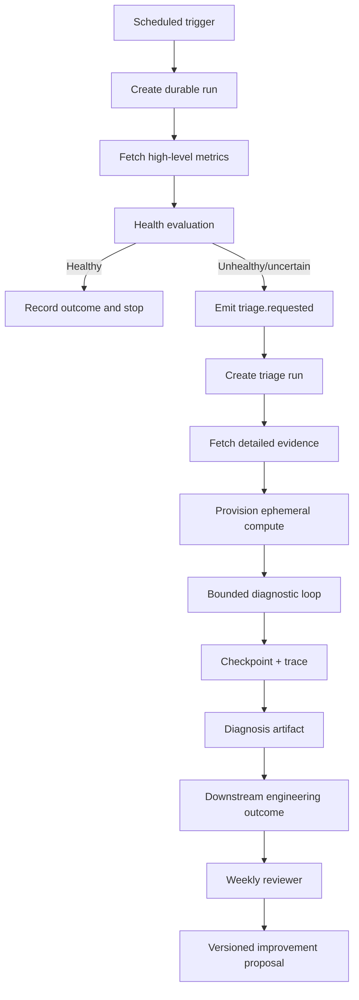

# Example: Durable Health-Triage Improvement Loop

## Goal

Continuously inspect system health, launch deeper triage only when needed, and periodically review whether the triage agent is useful.

## Three functions

### 1. Scheduled health check

- Trigger every 30 minutes.
- Pull high-level metrics.
- Ask a model whether the system is healthy under fixed criteria.
- If healthy, record outcome and stop.
- If unhealthy or uncertain, emit `triage.requested` with evidence references.

### 2. Triage agent

- Triggered asynchronously by `triage.requested`.
- Pull detailed metrics and recent changes.
- Provision an ephemeral sandbox if code analysis is needed.
- Loop through bounded diagnostic steps.
- Checkpoint after each evidence-producing step.
- Produce a diagnosis, confidence, evidence, recommended action, and unresolved uncertainty.

### 3. Weekly reviewer

- Pull the execution history, not only final reports.
- Compare triage decisions to downstream outcomes.
- Measure false alarms, missed incidents, useful reports, engineering actions, cost, and latency.
- Propose prompt, context, metric, or tool changes through a canary and rollback process.

## Durable flow

## Important boundary

The health prompt, selected model, metric set, and sandbox may change frequently. The event contract, run state, checkpoints, retry semantics, trace, and outcome linkage should remain stable.
